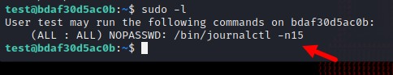
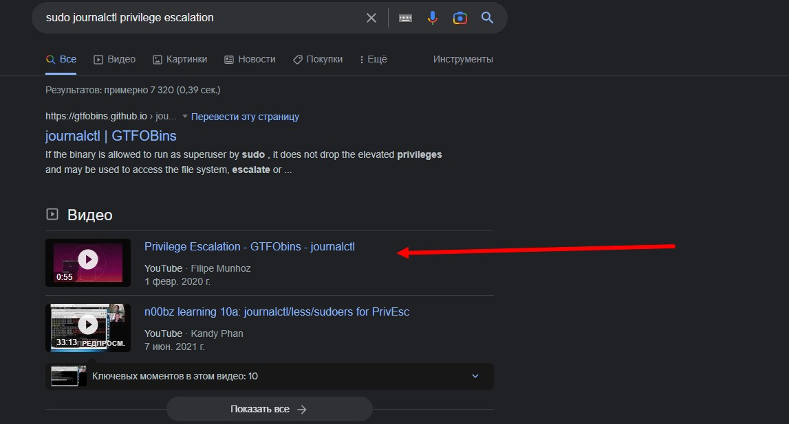
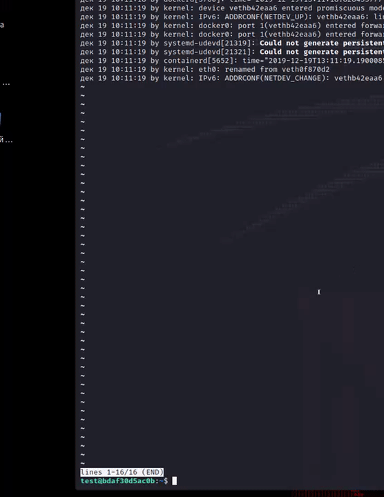

После того как мы получили доступ к пользователю test, попробуем посмотреть конфиг sudo:

Как мы видим мы можем исполнить команду journalctl -n15 без пароля

Гуглим как повышать привелегии с помощью journalctl:

Давайте посмотрим это [видео](https://www.youtube.com/watch?v%3Dany8EXHDsAQ)

А теперь попробуем сделать то же самое и получить флаг:

Наш флаг:

> surctf_pr1v1l3g3_escalation