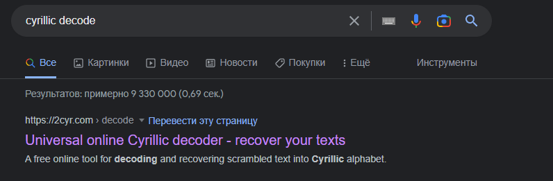
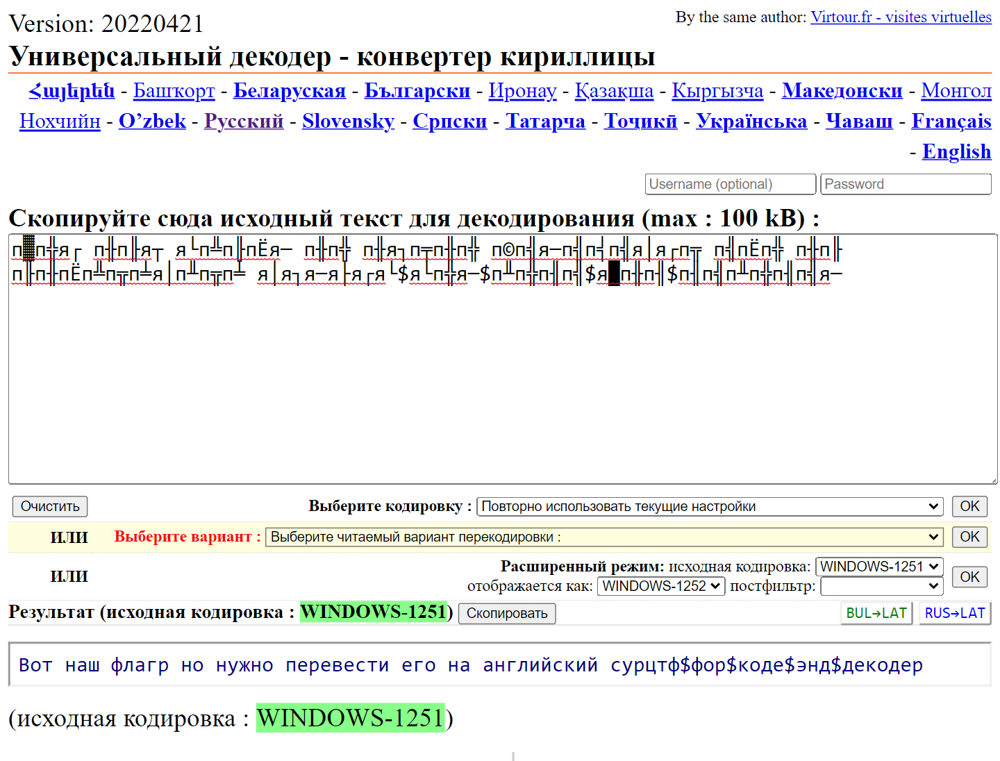

Прошаренные юзеры сразу же поймут, что здесь наблюдаются проблемы с кодировкой  
Идем и гуглим декодер кириллицы (всё таки таск называется [4RusWithLove](./README.md)):  
  

Открываем, вставляем текст, тыкаем ок:  
  

Переписываем флаг на английском (вот где пригодились уроки английского)
~~если уж совсем с английским никак, то пользуемся транслитератором~~  

Получаем заветный флаг:  

>surctf_for_code_and_decoder

**Радуемся! 🎉🎉🎉**