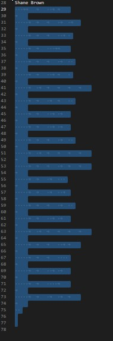
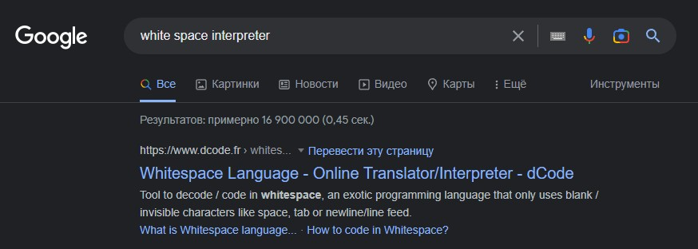

Для начала посмотрим видео об эзотерических языках программирования [тык](https://youtu.be/Ysled8GvKuk) 
~~если вам лень смотреть то вот: [ссылка с тайм-кодом](https://youtu.be/Ysled8GvKuk?t=433)~~

Из этого видео мы узнали что есть язык программирования под названием "White Space"
А теперь сравним то что есть у нас, с кодом на "White Space"
какой-то код на White Space |   Наш код
--- | --- 
 |   
Похожи? Я думаю, что да.
Находим какой нибудь интерпритатор White Space:
~~[поиск в гугл](https://track24.ru/google/?q=WhiteSpace%20interpreter%20dcode)~~
Гугло поиск |  Ссылка на dcode
--- | --- 
 | https://www.dcode.fr/whitespace-language

Вбиваем в него наши пробелы и табы, нажимаем **DECODE** и получаем флаг:

>surctf_leet_white_speak