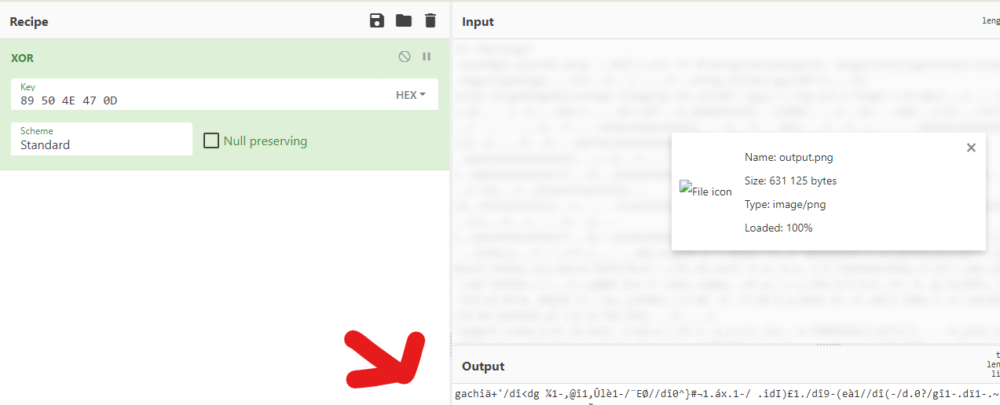
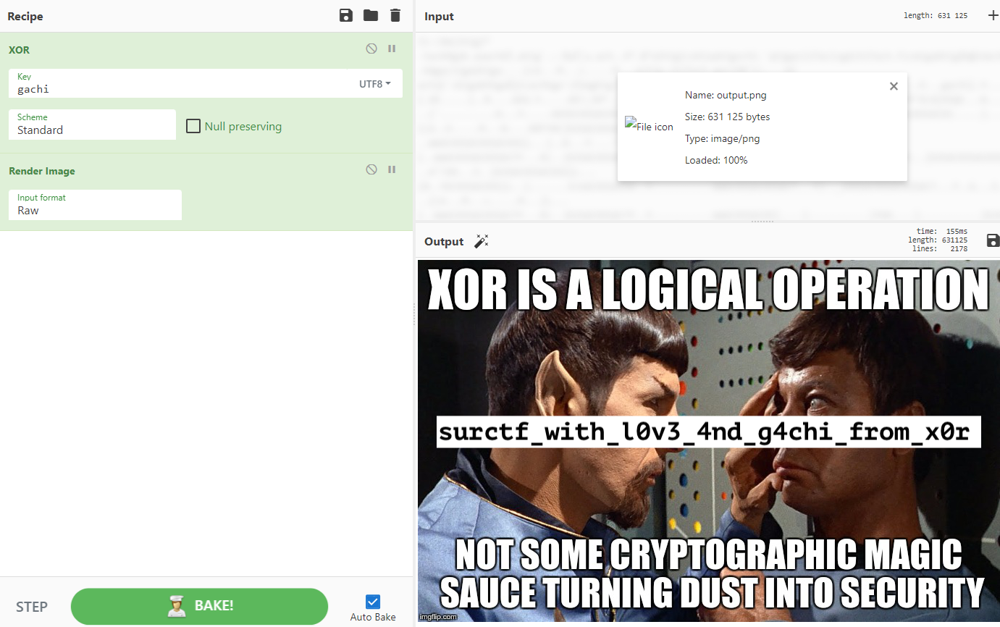
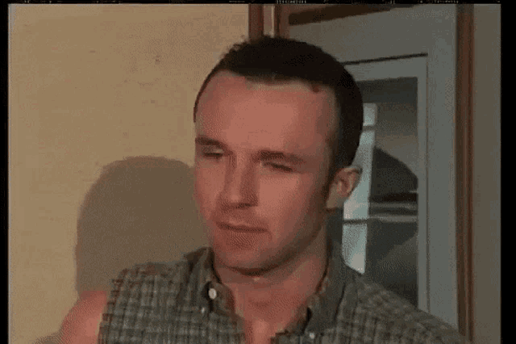

Залетаем с ноги в эту ***gym***, чтобы показать кто же тут ***boss***  

Мальчик Дима зашифровал **png** картинку, что мы видим из текста таска и имени зашифрованного файла ([output.png](./files/output.png))  


**ВАЖНО: наш ключ длиной 5 байт, это прописано в коде**

Код шифрования выполняет xor входного файла блоками по 5 байт  
> а я чет не понял... можно поподробнее?

> 0 байт картинки ксорится 0 символом ключа
1 байт картинки ксорится 1 символом ключа
2 байт картинки ксорится 2 символом ключа
3 байт картинки ксорится  3 символом ключа
4 байт картинки ксорится  4 символом ключа
5 байт картинки ксорится 0 символом ключа
6 байт картинки ксорится 1 символом ключа
7 байт картинки ксорится 2 символом ключа
8 байт картинки ксорится  3 символом ключа
9 байт картинки ксорится  4 символом ключа  

Мы знаем что xor вполне себе обратим:
> Обозначения: (p - plaintext), (k - key), (c - cyphertext)
> p xor k = c
> так же работает и в обратную сторону:
> c xor k = p
> c xor p = k  

Ну ладно, вроде разобрались...  Come on, let`s go!  

У формата png есть [хедер](https://en.wikipedia.org/wiki/Portable_Network_Graphics#File_header), то есть мы знаем некоторую часть незашифрованной картинки  

Берем 5 байт хедера ``` 89 50 4E 47 0D ``` и подставляем их в переменную *key* скрипта, или идем сразу в [CyberChef](https://gchq.github.io/CyberChef/)  


Первые 5 байт в output являются ключом шифрования  

Подставляем их в *key* и... не забываем сменить hex на utf-8  

Тыкаем на волшебную палочку и получаем магию:


> surctf_with_l0v3_4nd_g4chi_from_x0r

~~Welcome to the club, buddy!~~

Как жаль, что таск не стоит three hundred bucks :_(