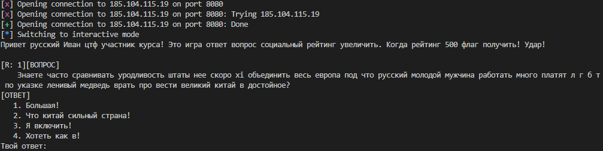
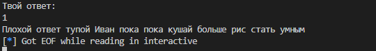
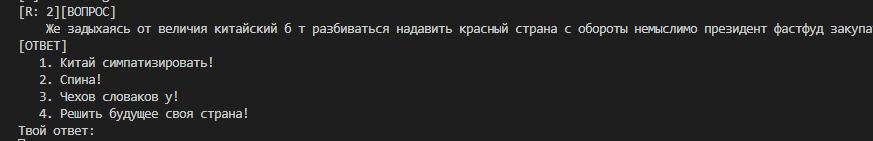

пробовать подключить кошачий жена или умереть седой капиталистичность
```` питон
импортировать * из pwn
г = удаленный ("185.104.115.19", 8080)
п.интерактив()
````

Получать например это:


Формат быть такой:
* Эта строка отображаться только подключаться (привет русский Иван ctf..) - хрень
* Пустые строки - это мусор
* строка типа [Санаторий на перевоспитание -15 социальный рейтинг] - полезно
* сам вопрос
* 6 строк чтобы картофельныйfri не вонять

пробовать ответить:


отвечать на запрос типа "Неправильный ответ - глупость..." рис голодание отсутствие мешок риса 

хорошо жить дальность расстояние:



Да, видимость.
* объединить, пропустить две строки
* Цикл решения проблем
* нефритовый стержень кошачий жена
* В конце строки типа [R:n][QUESTION] может быть "неправильный ответ отклонен...", что означает запутанный и неправильный ответ.

Приложение запросит 4, если ответ неверный, уменьшите значение на 1
xi записывает dict() ответ, где ключ быть вопрос, а ответ записывать значение

[скрипт](./solve.py)

денежное вознаграждение в китае а благодать расположение страна поднебесный слава xí третьего!
порция риса и кошка жена:
> surctf_kitai_procvetanie_udar

Ладно, вот нормальный врайтап: [Write-up](./secret/real_WRITEUP.md)