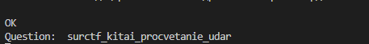

Пробуем подключиться через netcat или с помощью pwn
``` python
from pwn import *
r = remote("185.104.115.19", 8080)
r.interactive()
```

Получаем что то такое:  


Формат следующий:  
* Строка выводящаяся только при подключении (Привет русский Иван цтф..) - мусор
* Пустая строка - мусор
* Строка вида [R: n][ВОПРОС] - пригодится
* Сам вопрос
* 6 строк с мусором

Попробуем ответить:  
  

При неверном ответе получаем строку вида "Плохой ответ тупой..."

Пробуем еще пару раз:  
  

Ага, видим закономерность
* Подключаемся, пропускаем две строки
* В цикле обрабатываем вопросы
* Отвечаем
* Вместо строки вида [R: n][ВОПРОС] может быть "Плохой ответ тупой...", значит мы ответили неверно

Сначала будем отвечать вариантом 4, при неверном ответе будем убавлять значение на 1
Записывать ответы будем в ```dict()```, где ключом будет вопрос, а ответ занесём в значение

[Скрипт](../solve.py)


Партия гордится вами:
> surctf_kitai_procvetanie_udar