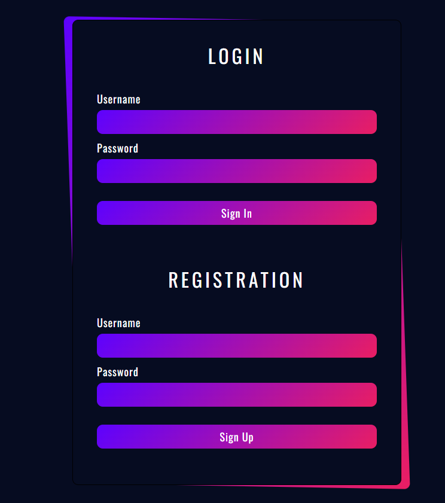
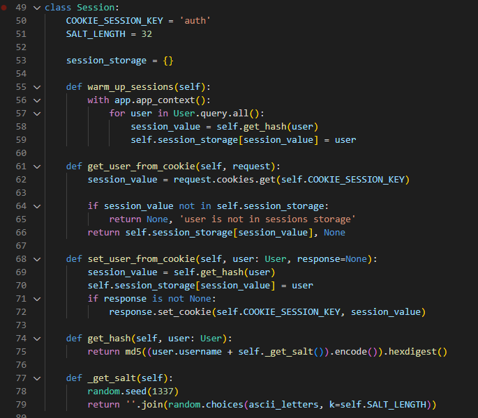
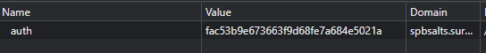
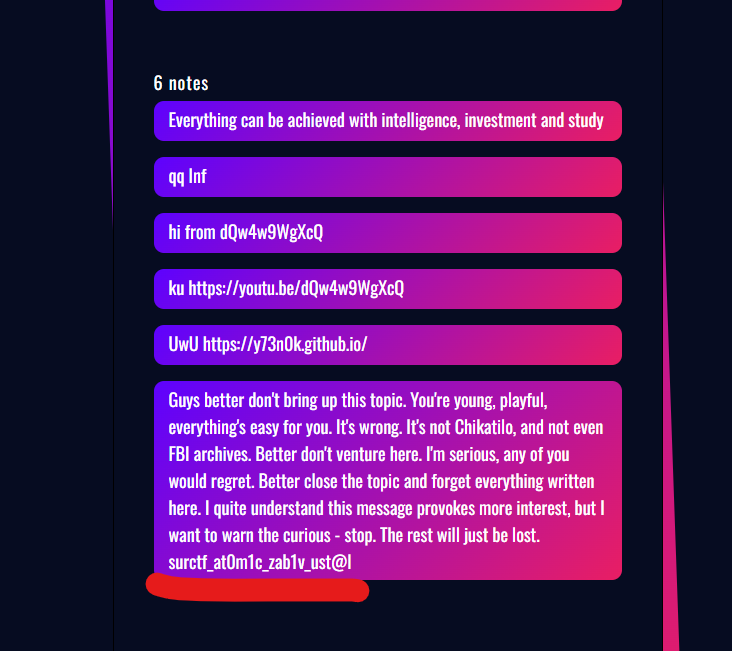

Посмотрим сайт


ммм красивое..  

А ну-ка зарегаемся  


Можно попробовать написать заметку, но мы не найдем ничего интересного, пойдем посмотрим исходники:  

Это класс для генерации куков авторизации  

При регистрации (и авторизации) вызывается метод set_user_from_cookie(), который и устанавливает наши куки  



Как он работает?
Записывает в куку auth результат функции get_hash

get_hash же отдает нам md5 хеш из username пользователя и соли...
Соль..
А она-то как генерируется?

Тут все совсем просто, генерируется она в методе _get_salt
Устанавливается семя для генерации рандомной строки.. так стоп
Семя всегда одинаковое?

ДА! и это значит, что мы можем самостоятельно сгенерировать куки админа

Просто копируем метод get_hash и _get_salt, заменяем self.SALT_LENGTH на его значение (32, это написано в строке 51)

Получаем такой незамысловатый скрипт:

```
import random
from string import ascii_letters
from hashlib import md5

def _get_salt():
    random.seed(1337)
    return ''.join(random.choices(ascii_letters, k=32))

print(md5(("admin" + _get_salt()).encode()).hexdigest())
```

Выполняем и получаем куки админа:
> b716de280ea0c1890a314029b0ec3d91

Заменяем нашу куку на эту, обновляем страницу и получаем флаг:  


>surctf_at0m1c_zab1v_ust@l